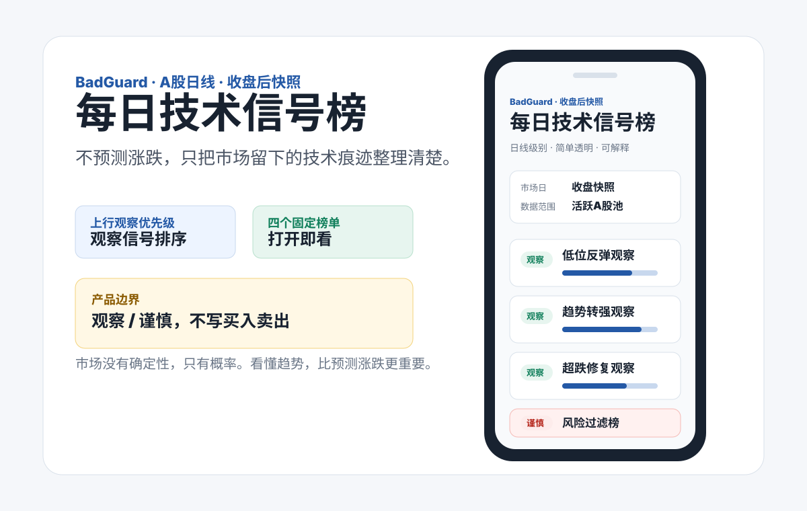
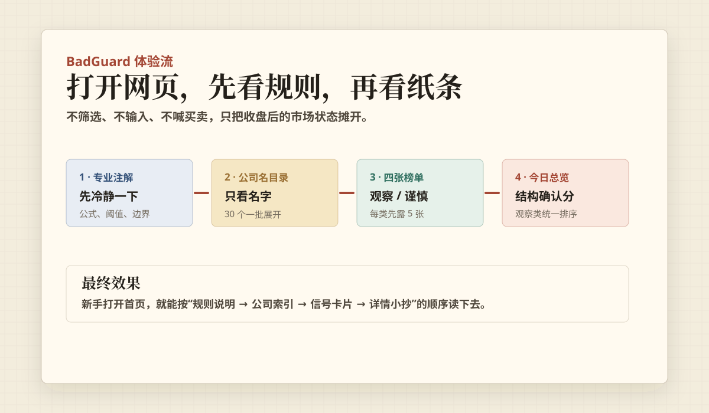
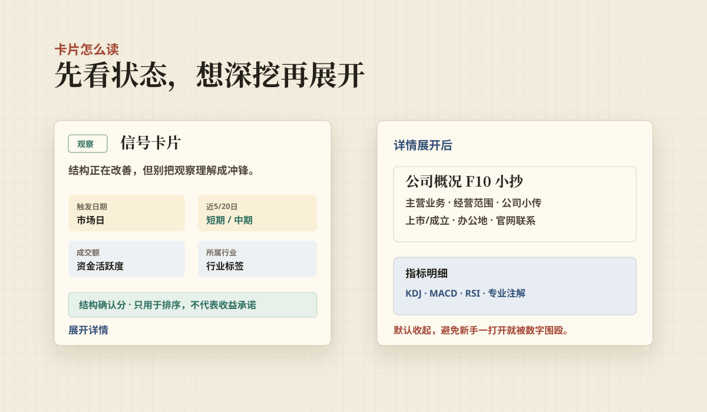
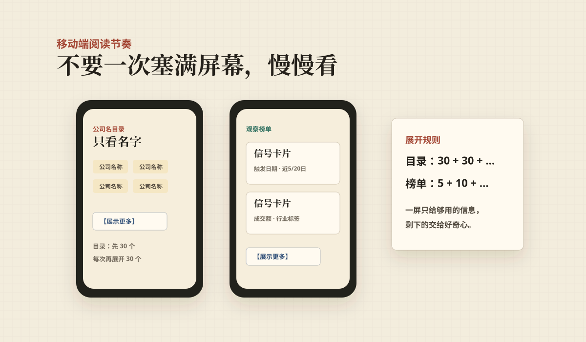

# BadGuard 散户看盘小纸条

> 体验链接：<https://badguard.nizabentley397.workers.dev>

打开就看，不用选条件，不用在选股器里把自己点成迷路的韭菜。BadGuard 每天收盘后把 A 股日线里几个常见技术状态整理成 4 张小纸条：只写“观察 / 谨慎”，不写交易指令。



<details>
<summary><strong>【更多项目体验截图】点开像翻 PPT 一样横向看</strong></summary>

| 首页阅读顺序 | 卡片与详情 | 移动端渐进展开 |
| --- | --- | --- |
|  |  |  |

</details>

## 这是个啥

它不是股神，也不是许愿池。它更像一个嘴有点贫、但边界很清楚的看盘小本本：

- 今天又来抄底啦：低位反弹观察
- 勇敢散户向前冲：趋势转强观察
- 跌麻了，先看修复：超跌修复观察
- 别冲了，先喝口水：风险过滤榜

主页面用轻松话术降低阅读血压，专业注解单独放在“冷静区”。笑归笑，指标条件不乱写。

首页在榜单前放了一个“公司名目录”，只显示公司名称，不显示分数、不显示指标。看到熟脸可以直接点过去，少一点滚屏，多一点人类尊严。

## 页面展示什么

每只股票只展示这些字段：

- 信号名、触发日期
- 成交额、所属行业
- 近 5/20 日涨跌幅
- 风险标签
- 观察 / 谨慎
- 结构确认分或风险强度

KDJ / MACD / RSI 的具体数值默认收起来，点“展开详情”再看。详情里还会显示“公司概况 F10 小抄”，重点放主营业务、主营构成、经营范围、公司简介、上市时间和联系方式，不重复卡片上已经写过的公司名和行业。页面不提供筛选条件，也不发出交易指令。

## 设计哲学

市场没有确定性，只有概率。技术指标不是预言，也不是“今天拜托你涨一下”的仪式；它只是把价格、成交量和波动留下的痕迹整理出来。上涨有上涨的结构，下跌有下跌的信号，普通投资者更需要看清状态，而不是追逐“必涨答案”。BadGuard 坚持简单、透明、可解释，只看少量经过长期使用的日线信号。它不是预测工具，而是市场节奏雷达：帮你看懂趋势，少一点拍脑袋。

## 专业注解

### 指标公式

所有信号都基于日线 OHLCV，不使用分钟线，也不在页面里做实时追涨小游戏。

- 均线：`MA_n(t) = 最近 n 个收盘价的算术平均`
- EMA：`EMA_n(t) = α * close(t) + (1 - α) * EMA_n(t-1)`，其中 `α = 2 / (n + 1)`
- MACD：`DIF = EMA_12 - EMA_26`，`DEA = EMA(DIF, 9)`，`Histogram = DIF - DEA`
- BOLL：`中轨 = MA_20`，`上轨 = MA_20 + 2 * σ_20`，`下轨 = MA_20 - 2 * σ_20`
- RSI6：先计算上涨/下跌幅的 Wilder 平滑均值，`RS = avgGain / avgLoss`，`RSI = 100 - 100 / (1 + RS)`
- KDJ9：`RSV = (close - 9日最低价) / (9日最高价 - 9日最低价) * 100`，`K = 2/3 * K_prev + 1/3 * RSV`，`D = 2/3 * D_prev + 1/3 * K`，`J = 3K - 2D`
- 成交量放大：`volumeRatio = 今日成交量 / 前 5 日平均成交量`
- 近 N 日涨跌幅：`returnN = (close(t) / close(t-N) - 1) * 100%`

### 四类信号

- 低位反弹观察：`K_prev <= D_prev` 且 `K > D`，并且 `min(K, D) <= 28`，同时 `volumeRatio >= 1.2`。这里的“20 附近”用 `<= 28` 做宽容阈值，避免因为小数和短期波动把贴近低位的金叉全筛没。
- 趋势转强观察：`DIF_prev <= DEA_prev` 且 `DIF > DEA`，并且 `close >= MA5` 且 `close >= MA10`。
- 超跌修复观察：`RSI_prev <= 38` 且 `RSI > RSI_prev + 1.5`，并且上一交易日靠近 BOLL 下轨 `close_prev <= lower_prev * 1.02`，当前收回 `close >= lower`。
- 风险过滤榜：以下风险项至少命中 2 个：跌破 5 日线、低于 10 日线、单日跌幅超过 1.5% 且 `volumeRatio >= 1.25`、KDJ 在高位区域形成死叉。

### 结构确认分

页面不再把排序分叫“上涨概率”。它现在叫 `结构确认分`，含义是：这个观察信号在趋势、量能、修复质量、近期表现和风险扣分之间，看起来有多完整。它只用于排序，不代表未来收益率。

```text
结构确认分 = clamp(round(基础分 + 趋势确认 + 量能确认 + 近期表现 + 信号质量 - 风险扣分), 0, 100)
```

基础分按信号类型区分：趋势转强 62，低位反弹 46，超跌修复 44。这样做是因为“已经站回均线并形成 MACD 金叉”的趋势确认度，高于“刚从低位抬头”的早期修复信号。

趋势确认最高 45 分附近：站上 MA5 加 8，站上 MA10 加 8，站上 MA20 加 6，MA5 高于 MA10 加 5，DIF 高于 DEA 加 8，MACD 柱体改善加 6，KDJ 保持金叉加 4。

量能确认：`min(12, max(0, volumeRatio - 1) * 7)`。成交量不是越大越好，但信号刚出现时，温和放量比缩量独舞更值得被排到前面。

近期表现：`clamp(近5日, -8, 12) * 1.2 + clamp(近20日, -15, 18) * 0.35`。短期改善权重更高，20 日表现只做背景确认，避免一个很久以前的涨幅把今天的小纸条吹得太胖。

信号质量按类型加分：趋势转强看 `DIF - DEA` 和价格站上 MA5/MA10 的距离；低位反弹看 KDJ 是否足够低、金叉开口是否扩大；超跌修复看 RSI 抬升幅度、价格收回 BOLL 下轨的程度，以及 RSI 是否仍处于相对低位。

风险扣分：跌回 MA10 扣 12，低于 MA20 扣 18，放量下跌扣 12，KDJ 死叉扣 10，近 5 日跌幅小于 -5% 扣 6，RSI 高于 78 扣 6。

风险过滤榜使用 `风险强度` 排序：

```text
风险强度 = clamp(round(48 + 风险标签数 * 8 + 单日跌幅项 + 放量项 + 高位KDJ项), 0, 100)
```

`今日围观总览` 只汇总前三类观察信号，并按 `结构确认分` 排序。风险过滤榜只负责提醒谨慎，不混进观察排序里凑热闹。

### 依据与边界

这个算法的依据不是“指标能预测未来”，而是把常见市场状态拆成可复查的规则：趋势跟随、均线确认、动量改善、波动带修复、成交量确认和风险扣分。动量与技术规则在学术研究里长期被讨论，例如 Jegadeesh 和 Titman 的动量研究、Brock/Lakonishok/LeBaron 的移动平均与交易区间规则、Lo/Mamaysky/Wang 对技术形态的统计化处理。对中国市场，简单技术规则在考虑交易成本后并不稳定，所以 BadGuard 只把它们当“观察雷达”，不当自动交易系统。

参考阅读：

- [Jegadeesh & Titman, Returns to Buying Winners and Selling Losers, 1993](https://onlinelibrary.wiley.com/doi/abs/10.1111/j.1540-6261.1993.tb04702.x)
- [Brock, Lakonishok & LeBaron, Simple Technical Trading Rules and the Stochastic Properties of Stock Returns, 1992](https://onlinelibrary.wiley.com/doi/10.1111/j.1540-6261.1992.tb04681.x)
- [Lo, Mamaysky & Wang, Foundations of Technical Analysis, 2000](https://www.nber.org/papers/w7613)
- [Zhu et al., Profitability of simple technical trading rules of Chinese stock exchange indexes, 2015](https://arxiv.org/abs/1504.04254)

## 每日更新

生产数据流：

1. GitHub Actions 在北京时间交易日 15:30 运行 AkShare 脚本。
2. 默认扫描成交额靠前的 1000 只活跃 A 股，生成 `data/latest.json`。
3. Actions 先写入日期快照 `signal-snapshot:YYYY-MM-DD`，再更新 `latest-signal-snapshot`。
4. Worker 读取 `latest-signal-snapshot` 渲染页面；没有 KV 时读取随代码部署的最近快照。

同一个市场日的生产快照默认不覆盖，避免同一天数据因为调试参数变化而来回跳。手动触发 `Refresh AkShare Signals` 默认只写 `staging-signal-snapshot`，可以调整 `scan_limit` 做验证；只有显式设置 `publish_production=true`，并在需要重发同日数据时设置 `force_publish=true`，才会写入生产快照。全市场扫描可以填 `scan_limit=0`，它会更慢，耐心也是一种指标。

## 公司概况 F10 库

公司基本情况不会像日线指标那样天天跳，所以项目里单独放了一个固定数据库。日常收盘刷新只更新技术信号；F10 库可以低频维护，例如一周或一个月补一次。

- `data/company-profiles.json`：页面读取的公司概况库
- `scripts/build_company_profiles.py`：从信号快照提取涉及股票，再用 AkShare 收集巨潮公司概况和东方财富主营构成

项目使用 `uv` 管理 Python 虚拟环境。首次补全 F10 时运行：

```bash
uv sync
npm run akshare:profiles
```

这会调用 AkShare 的公司概况和主营构成接口，补全主营业务、经营范围、机构简介、上市日期、办公地址、官网和主营收入占比等静态字段。脚本不会编造缺失字段；F10 数据仍建议人工抽查，毕竟连散户都知道，资料库偶尔也会犯困。

## 本地运行

```bash
npm install
uv sync
npm run akshare:build:quick
npm run akshare:profiles
npm run dev
```

打开 `http://127.0.0.1:8787`。

`akshare:build:quick` 会用真实 AkShare 数据生成快速预览快照，默认取前 500 只股票。

## Cloudflare Workers 部署

创建 KV namespace：

```bash
npx wrangler kv namespace create SIGNAL_KV
npx wrangler kv namespace create SIGNAL_KV --preview
```

把返回的 `id` 和 `preview_id` 填入 `wrangler.toml`。

GitHub Actions 需要配置：

- `CLOUDFLARE_ACCOUNT_ID`
- `CLOUDFLARE_API_TOKEN`

`CLOUDFLARE_API_TOKEN` 建议使用最小权限 Token，至少需要 Workers Scripts 写入和 Workers KV 写入权限。不要把 API Token 写进代码或 README。

手动部署：

```bash
npm run deploy
```

## API

- `GET /api/signals`：返回当前信号快照
- `POST /api/refresh`：仅在配置兼容 JSON 行情源时手动刷新；如果配置了 `REFRESH_TOKEN`，需要请求头 `x-refresh-token`
- `GET /api/health`：健康检查

## 免责声明

BadGuard 仅用于个人学习和技术指标观察，只描述历史交易数据形成的状态，不构成投资建议、个股推荐或收益承诺。任何指标都不能保证上涨，也不能准确预测未来。请结合基本面、流动性、仓位和自己的风险承受能力判断。

## 开源协议

MIT
