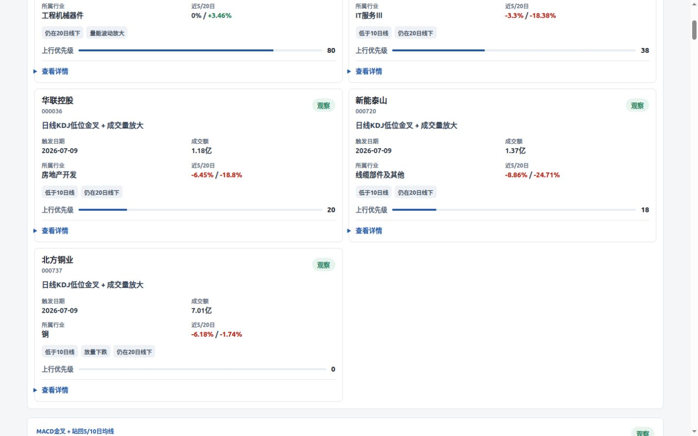

# BadGuard 每日技术信号榜

> 体验链接：<https://badguard.nizabentley397.workers.dev>

BadGuard 是一个面向新手投资者的 A 股日线技术信号快照站。页面不提供筛选条件，不输出买入/卖出判断，只把每天收盘后的技术状态整理成 4 个固定榜单，并用“观察 / 谨慎”表达。



## 功能

- 低位反弹观察：日线 KDJ 在 20 附近或以下金叉，且成交量放大
- 趋势转强观察：MACD 金叉 + 股价站回 5/10 日均线
- 超跌修复观察：RSI 低位回升 + BOLL 下轨收回
- 风险过滤榜：近期跌破均线、放量下跌、KDJ 高位死叉
- 今日信号总览：只汇总观察类信号，按“上行观察优先级”排序
- 移动端优先卡片界面，KDJ / MACD / RSI 放在“查看详情”里展开

## 产品边界

技术指标只描述历史价格、成交量与波动状态，不保证上涨，也不能准确预测未来。本项目定位是市场节奏雷达，帮助不会使用复杂选股器的用户快速理解“今天哪些股票出现了可解释的技术状态”。

## 本地运行

```bash
npm install
python3 -m pip install -r requirements.txt
npm run akshare:build:quick
npm run dev
```

打开 `http://127.0.0.1:8787`。

`akshare:build:quick` 会用 AkShare 生成一份真实日线快照，默认取前 500 只股票，适合本地快速预览。

## 每日快照

生产数据流推荐为：

1. GitHub Actions 在北京时间交易日收盘后运行 AkShare 脚本。
2. 脚本生成 `data/latest.json`。
3. Actions 把快照上传到 Cloudflare Workers KV 的 `latest-signal-snapshot`。
4. Worker 读取 KV 并渲染页面；没有 KV 时读取随代码部署的 `data/latest.json`。

手动生成全市场快照：

```bash
python3 scripts/build_akshare_snapshot.py --output data/latest.json
```

手动上传到 Workers KV：

```bash
npx wrangler kv key put latest-signal-snapshot --path data/latest.json --namespace-id <KV_NAMESPACE_ID> --remote
```

## Cloudflare Workers 部署

1. 安装依赖：

```bash
npm install
```

2. 创建 KV namespace：

```bash
npx wrangler kv namespace create SIGNAL_KV
npx wrangler kv namespace create SIGNAL_KV --preview
```

3. 把返回的 `id` 和 `preview_id` 填入 `wrangler.toml` 的 `kv_namespaces`。

4. 配置 GitHub Actions secrets：

- `CLOUDFLARE_ACCOUNT_ID`
- `CLOUDFLARE_API_TOKEN`

当前部署使用的值：

- `CLOUDFLARE_ACCOUNT_ID`: `c150f9a81fd3d95a9c31d5751c99eabc`
- `SIGNAL_KV id`: `b1aa99421784423cb2669d98ffb302eb`
- `SIGNAL_KV preview_id`: `f20d6971ccb24ec68ae81768e1f0ca8e`
- `CLOUDFLARE_API_TOKEN`: 在 Cloudflare Dashboard 创建，至少需要 Workers Scripts 写入和 Workers KV 写入权限

5. GitHub Actions：

- `Deploy Worker`：push 到 `main` 或手动触发时，运行测试并部署 Worker
- `Refresh AkShare Signals`：北京时间交易日 15:30 自动生成新快照并上传 Workers KV
- `Setup Cloudflare`：首次接入新 Cloudflare 账号时手动触发，创建 KV namespace 并把新 ID 写回仓库

6. 手动部署 Worker：

```bash
npm run deploy
```

部署完成后，把 README 顶部的体验链接替换成实际 Workers.dev 链接。

## API

- `GET /api/signals`：返回当前信号快照
- `POST /api/refresh`：仅在配置兼容 JSON 行情源时手动刷新；如果配置了 `REFRESH_TOKEN`，需要请求头 `x-refresh-token`
- `GET /api/health`：健康检查

## 开源协议

MIT
